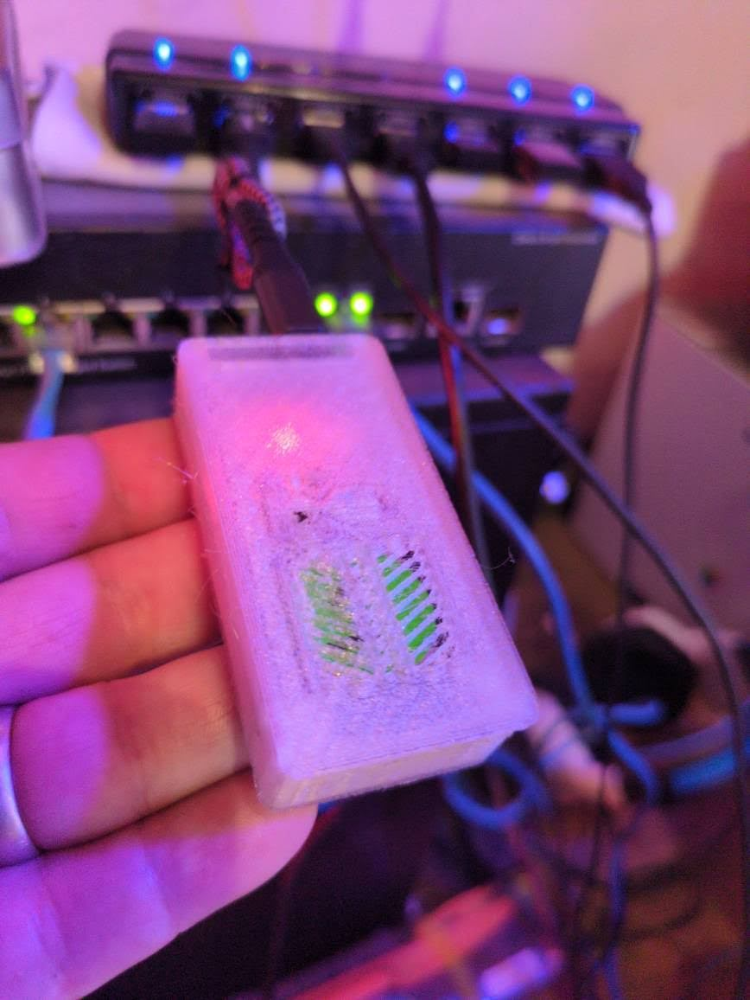
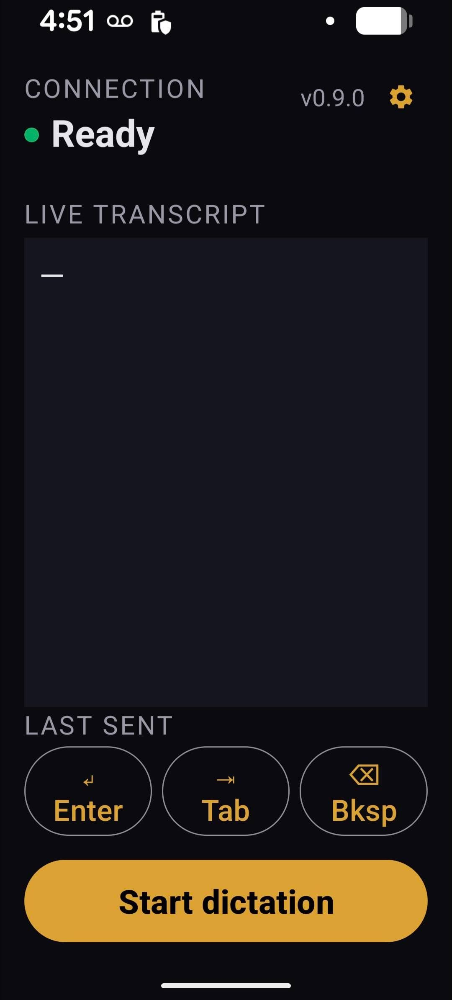
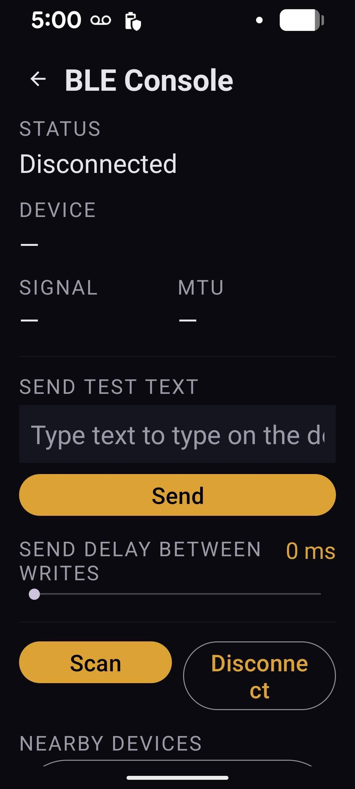

# STT Keyboard Dongle

Talk into your phone; the words type themselves into any computer through a tiny
USB dongle that looks like an ordinary keyboard. No software, drivers, or pairing
on the target machine.

```
  Android phone            ESP32-S3 dongle              Target computer
  mic → on-device ASR  ──BLE──▶  BLE peripheral  ──USB-HID──▶  sees a normal
  BLE central          write text  + USB HID kbd  types keys    USB keyboard
```

## See it in action

<table>
  <tr>
    <td align="center" width="34%">
      <br>
      <sub><b>The dongle</b> — an ESP32-S3 in a 3D-printed case. The status LED glows through the print; it plugs into any host as an ordinary USB keyboard.</sub>
    </td>
    <td align="center" width="33%">
      <br>
      <sub><b>Main screen</b> — connected (“Ready”), a live transcript, Enter/Tab/Bksp keys, and a big <i>Start dictation</i> button.</sub>
    </td>
    <td align="center" width="33%">
      <br>
      <sub><b>BLE Console</b> (gear) — connected and <b>Ready</b>: live device name, signal (−50 dBm) and negotiated MTU, plus send-test-text, a per-write delay slider, and a nearby-devices list for switching dongles. <sub>(BLE address masked.)</sub></sub>
    </td>
  </tr>
</table>

See [`stt-keyboard-dongle-spec.md`](stt-keyboard-dongle-spec.md) for the product
spec, [`PROTOCOL.md`](PROTOCOL.md) for the frozen BLE contract,
[`SESSION-LOG.md`](SESSION-LOG.md) for the build/validation history, and
[`ROADMAP.md`](ROADMAP.md) for what's next (the security roadmap + backlog).

---

## Status — `v0.10` (Build B — app-level auth token; the preferred build)

**Working on real hardware.** ESP32-S3 dongles run as USB-HID keyboards; phone dictation
types into any computer end-to-end (special keys + punctuation + activity LED) over a
stable BLE link. Validated incl. live voice; three units in service, more flashing as they arrive.

🔒 **Security — app-level auth token (default).** The dongle ignores keystroke writes
until the app presents a **per-dongle shared token**, so a stranger nearby can't inject
keystrokes. The token is generated on the dongle and kept in flash; the app reads it
automatically on first connect (**tap-to-provision — no typing**) and re-sends it on every
reconnect. This blocks casual proximity injection. It is **not** sniffer-proof yet (the BLE
link is unencrypted); encrypted bonding is **Build C** (task #22), still future.

> The earlier **open build** — no token, so any nearby BLE device (~10 m) could inject
> keystrokes (BadUSB-class) — is **deprecated**. It still builds as an explicit opt-out
> (`-DREQUIRE_AUTH_TOKEN=0`) for backward-compat testing only; the gated build is the
> default and recommended everywhere. The app is backward compatible — it drives both
> open and gated dongles (it just sends text directly when a dongle exposes no auth gate).

| Path | What it is | Status |
|------|-----------|--------|
| `firmware/firmware.ino` | **ESP32-S3** production: USB-HID keyboard + BLE GATT + paced typing + Enter/Tab/Backspace; **auth-token gate + tap-to-provision** (`REQUIRE_AUTH_TOKEN`, default **1**) | ✅ flashed + validated on the S3 |
| `firmware-ble-test/` | **ESP32-C6** BLE proxy: same BLE/UUIDs, echoes text to serial; LED activity; `CLEAN_SERIAL` raw-stream mode | ✅ flashed + validated |
| `android/` | Native Kotlin app: BLE central + on-device STT | ✅ builds |
| `STT-Keyboard-debug.apk` | Installable app — **v0.10.1** | ✅ on the phone |
| `tools/stt_send.py` | Python (bleak) BLE harness — phone stand-in; `--token` for the auth handshake | ✅ |
| `tools/provision_test.py` | Validates the auth + provisioning-window flow over BLE | ✅ |
| `tools/serial_type.py` | **Windows**: reads the dongle's serial and types it (software HID, for the C6 proxy) | ✅ |
| `install.sh` / `install.bat` | One-command APK install | ✅ |
| `docs/` | BUILD_FLASH, TESTING, HARDWARE, TROUBLESHOOTING | ✅ |
| `PROTOCOL.md` | BLE contract (incl. auth + provisioning) | ✅ |

### App features (v0.10.1)
- Live on-device dictation → BLE → dongle, chunked & in order
- **Auth token**: stored per dongle, sent on connect, and **auto-read on first connect** (tap-to-provision — no typing). Backward compatible with open-build dongles.
- **BLE Console** (gear icon): scan/connect, device name/address/RSSI/MTU, auth-token field, send-test-text, send-delay
- **Multi-dongle**: each dongle advertises a unique `STT-Keyboard-XXXX` name; app **remembers** the chosen dongle (tap another to switch)
- **Special keys** (Tier 1): Enter / Tab / Backspace via on-screen buttons **and** voice ("new line", "tab", "backspace")
- **Keep-screen-awake** while dictating; on-screen **version label**

---

## Quick start

### Phone app
Install `STT-Keyboard-debug.apk` (copy to the phone and tap, or `install.sh` /
`install.bat` over adb). Runs standalone (live transcript) until a dongle is in range.

### Firmware
```bash
# Production, ESP32-S3 (real keystrokes) — gated/auth-token build is the DEFAULT:
arduino-cli compile --fqbn esp32:esp32:esp32s3:USBMode=default,CDCOnBoot=cdc firmware
# Deprecated open build (no auth gate) — explicit opt-out, for backward-compat testing:
arduino-cli compile --fqbn esp32:esp32:esp32s3:USBMode=default,CDCOnBoot=cdc \
  --build-property "compiler.cpp.extra_flags=-DREQUIRE_AUTH_TOKEN=0" firmware
```
`USBMode=default` (TinyUSB) is **required** for HID on the S3. The app provisions the
auth token automatically on first connect, so no extra setup is needed. See
`docs/BUILD_FLASH.md`.

### Test the dongle without the phone (Milestone 2)
```bash
cd tools && python -m venv .venv && . .venv/bin/activate && pip install -r requirements.txt
python stt_send.py "hello world"     # writes text to the dongle
```

### Software-HID on Windows via the C6 proxy (no S3 needed)
Flash the C6 with `CLEAN_SERIAL=1`, put it on a Windows COM port, then:
```
python tools\serial_type.py          # types the dongle's serial into the focused field
```
Now dictate on the phone → it types into any Windows form. See `tools/README.md`.

---

## Build milestones (spec §8)
1. **USB-HID only** — `SELFTEST_TYPE_ON_BOOT 1`, flash S3, watch it type a banner.
2. **BLE → types** — `stt_send.py "hello"` writes; dongle types.
3. **App ↔ dongle** — app connects and writes text.
4. **STT end-to-end** — speak, watch it type.

M0 (BLE-only pre-test on the C6) is done; M1–M4 add real keystrokes on the S3.
See `docs/TESTING.md`.

---

## License

[MIT](LICENSE) © 2026 Scott Whitney / Whitney Design Labs.

> 🔒 The default build gates keystroke injection behind a **per-dongle auth token**
> (see Status, above) — this blocks casual proximity injection but is **not**
> sniffer-proof, since the BLE link is still unencrypted. Encrypted bonding is the
> next step (Build C, #22). The deprecated open build has **no** such protection;
> don't use it on shared/unattended/safety-critical machines.
